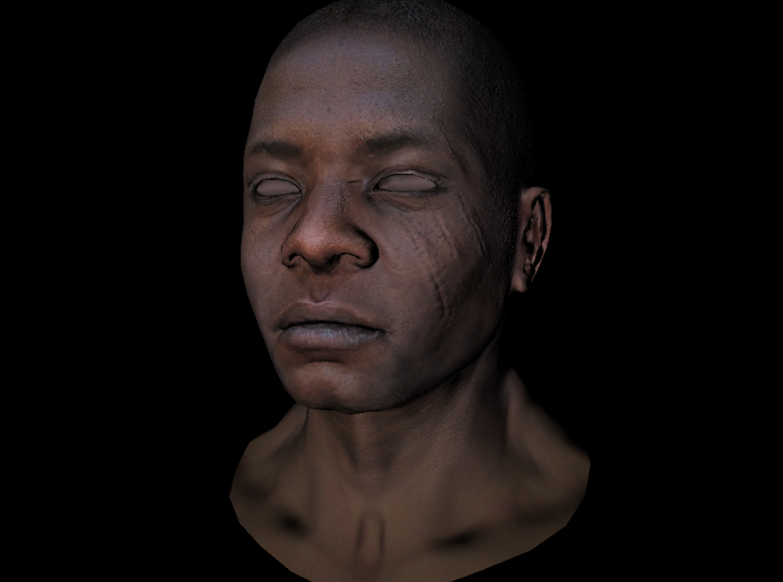
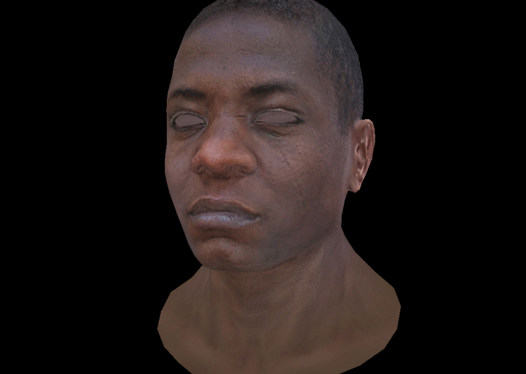

# TinyRenderer

A software renderer implemented in C++ for learning and understanding the basic principles of 3D graphics rendering.

Inspired by [tinyrenderer](https://github.com/ssloy/tinyrenderer) and [GAMES101](https://sites.cs.ucsb.edu/~lingqi/teaching/games101.html).

Here are some outputs :





## Features

- Software renderer built from scratch
- Basic 3D model rendering support
- Z-buffer algorithm implementation
- Texture mapping and normal mapping support
- Benchmarking suite included

## Structure

```
├── Core Renderer Files
│   ├── rasterizer.cpp/h    - Rasterizer implementation
│   ├── shader.cpp/h        - Shader implementation
│   ├── model.cpp/h         - 3D model loading and processing
│   └── tgaimage.cpp/h      - TGA image processing
│
├── Math Utilities
│   ├── gmath.hpp          - Math library
│   └── gutils.hpp         - General utility functions
│
├── Benchmarks
│   ├── linebench_main.cpp     - Line drawing benchmark
│   ├── matrixbench_main.cpp   - Matrix operations benchmark
│   ├── trianglebench_main.cpp - Triangle drawing benchmark
│   └── zbufbench_main.cpp     - Z-buffer operations benchmark
│
├── Resources
│   ├── obj/               - 3D model files
│   └── texture/           - Textures and normal maps
```

## Building

The project uses Make build system. You can build the project using the following commands:

```bash
# debug version , support gdb and gprof
make debug

# release version, lighter object and faster linking
make release

# benchmark for some functions , well...
make bench
```

## Supported Features

- Wireframe rendering
- Triangle filling
- Z-buffering
- Texture mapping
- Normal mapping
- Basic lighting model

## Example Models

The project includes several example 3D models:

- african_head (with texture and normal maps)
- diablo3_pose
- cube
- reconstructed_head

## Performance Optimization

The project includes multiple benchmark programs for testing and optimizing performance in:

- Line drawing
- Matrix operations
- Triangle rasterization
- Z-buffer operations
